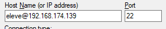

# Machine virtuelle ubuntu-docker
Ce petit guide va te faciliter la vie dans le dangereux monde de ***docker***

Tout est disponible en ligne sur Github : https://github.com/ThomasAmstutz/ubuntu-docker-vm

Tout d'abord, on va se connecter à la machine, lance-la et connecte-toi directement dans la VM ou utilise ***Putty*** !

## Infos de connexion
Nom d'utilisateur  | Mot de passe | Adresse IP (normalement)
- | - | -
eleve  | Admlocal1 | 192.168.174.139

## Se connecter avec Putty
Si tu n'as pas encore Putty, télécharge-le ici : https://www.putty.org/.

Lance Putty et tape ceci : <br>
<br>
si ça ne fonctionne pas, vérifie que la VM est bien allumée et que l'ip est bien la bonne. (```ifconfig``` pour vérifier)

## La machine
Cette machine fonctionne sous Ubuntu Live Server 20.04 LTS et Docker est déjà installé pour tes beaux yeux **\*wink wink***.
<br>
Il te reste plus qu'à faire les exercices ! Si tu veux savoir comment tout a été installé, la suite est pour toi.

## Installer docker
J'ai suivi [ce tuto](https://www.hostinger.com/tutorials/install-docker-on-ubuntu/) mais je vais te résumer le tout.

Commence par faire tes mises à jour : `sudo apt-get update && sudo apt-get upgrade -y`

Installe docker : `sudo apt install docker.io`

Maintenant on mets docker dans les services : `sudo systemctl start docker`
<br>Et on le démarre automatiquement : `sudo systemctl enable docker`

Tu peux vérifier ton installation comme ça : `sudo systemctl status docker`
<br>Et voir la version de docker ainsi : `docker -v`

### Mettre son utilisateur dans le groupe docker
Actuellement, chaque commande docker devra être préfixée par "sudo". Ce qui bien évidemment pose des problèmes de sécurité. Pour le corriger on va ajouter l'utilisateur eleve au groupe docker, comme ça on aura plus besoin d'ajouter "sudo".

On va créer le groupe docker (normalement il existe déjà) : `sudo groupadd docker`<br>
Maintenant on ajoute l'utilisateur courant au groupe docker : `sudo gpasswd -a $USER docker`<br>
Et pour finir, on va activer les changement en faisant : `newgrp docker` ou en se déconnectant et en se reconnectant.